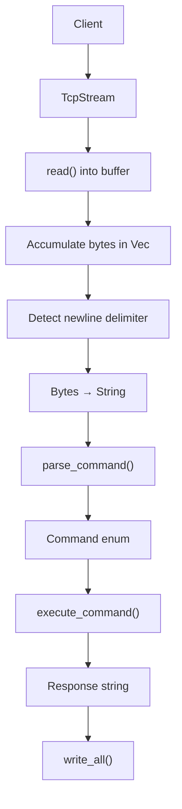

# Systems Engineering in Rust

Building low-level systems from first principles in Rust.

This repository is a long-term systems engineering playground focused on understanding how real systems work under the hood — networking, concurrency, protocol design, storage, persistence, and distributed systems intuition.

The goal is **not premature abstraction**, but earning abstractions through implementation.

Instead of hiding complexity behind frameworks, the focus is on understanding:

- how TCP actually behaves
- protocol design tradeoffs
- failure modes
- concurrency boundaries
- storage evolution
- systems architecture decisions

---

## Philosophy

This repository follows a simple principle:

> Understand deeply → build incrementally → earn abstractions.

Each phase starts intentionally simple and evolves only when requirements force complexity.

The objective is not to "finish projects quickly", but to build systems intuition through engineering tradeoffs and failure-driven learning.

That means:

- correctness before optimization
- explicitness over magic
- understanding before abstraction
- incremental architecture evolution

---

# Current Progress

## Phase 0 — Blocking TCP + Protocol Parsing + In-Memory Store ✅

Implemented:

### Networking

- Blocking TCP server
- `TcpListener` and `TcpStream`
- Persistent client connections
- Read/write communication model

### Protocol Handling

- Newline-delimited framing
- TCP fragmentation handling
- Multiple commands in a single read
- Command accumulation via byte buffering
- Typed protocol parsing

### Command System

Supported commands:

```text
SET key value
GET key
DELETE key
```

Example:

```text
SET name nishant
OK

GET name
VALUE nishant

DELETE name
OK
```

### Storage

- In-memory key-value store
- `HashMap<String, String>`
- Encapsulated database layer

### Reliability & Validation

- Structured protocol errors
- Malformed input handling
- Empty command handling
- Invalid format validation
- Disconnect handling
- Automated protocol tests

---

# Architecture Snapshot

Current execution flow:



---

# Why This Exists

The intention of this repository is to understand systems by building them.

For example, even a "simple TCP server" introduces real engineering problems:

- TCP is a stream of bytes, not messages
- Commands may arrive fragmented across multiple reads
- Multiple commands may arrive in a single read
- Protocol framing must be explicitly designed
- Error handling affects protocol reliability
- Architecture decisions impact extensibility

Each phase documents these tradeoffs explicitly.

---

# Engineering Notes

Every phase includes detailed engineering notes documenting:

- system design decisions
- protocol tradeoffs
- failure modes
- implementation reasoning
- lessons learned
- architecture evolution

### Start Here

- [Phase 0 Notes](./docs/phase0.md)

---

# Running the Project

Start server:

```bash
cargo run
```

Connect using netcat:

```bash
nc 127.0.0.1 8080
```

Example interaction:

```text
SET framework rust
OK

GET framework
VALUE rust

DELETE framework
OK
```

---

# Roadmap

This repository evolves incrementally.

Future phases will introduce:

- concurrency
- synchronization primitives
- persistence strategies
- protocol evolution
- systems scaling tradeoffs

---

## Key Principle

> Simple first. Correct second. Complex only when earned.