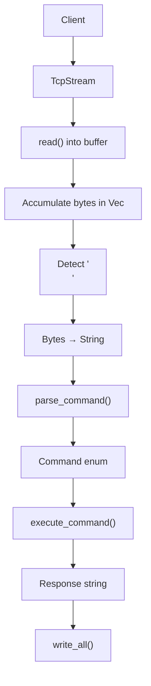

# Phase 0 — Blocking TCP + Protocol Parsing + In-Memory Store

## Goal

This phase builds a blocking TCP server that:

- accepts TCP connections
- receives newline-delimited commands
- parses commands into a typed enum
- executes commands against an in-memory store
- sends line-delimited responses back to client

---

# Mental Model

Our server is a **single-threaded blocking TCP server**.

Meaning:

- one client handled at a time
- TCP connection stays alive
- server continuously reads bytes
- commands are processed line-by-line

Important:

> TCP is a stream of bytes, NOT a stream of messages.

This heavily affects how we design parsing.

---

# High-Level Architecture



---

# Core Components

## TcpListener

`TcpListener` acts as the server socket.

Responsibilities:

- bind to an address and port
- listen for incoming clients
- yield `TcpStream` for each connection

Example:

```rust
TcpListener::bind("127.0.0.1:8080")
```

Meaning:

> start listening for TCP connections on this address.

Then:

```rust
listener.incoming()
```

returns an iterator that continuously waits for new connections.

Conceptually:

```rust
loop {
    wait_for_connection()
}
```

Each item yielded is:

```rust
Result<TcpStream, Error>
```

Meaning:

- `Ok(TcpStream)` → successful connection
- `Err(Error)` → failed connection

This is why:

```rust
let mut stream = stream?;
```

unwraps the result.

---

## What happens if two clients connect?

Current architecture is:

- blocking
- single-threaded

Meaning:

only one client is actively handled at a time.

Example:

```text
Client A connects
↓
handle_client() starts
↓
server blocks
```

If Client B connects:

the OS accepts the connection,
but our application waits to process it until Client A disconnects.

---

## TcpStream

`TcpStream` is a communication channel between:

```text
client ⇄ server
```

It behaves like a continuous stream of bytes.

It is duplex:

- can read data
- can write data

Example:

```rust
stream.read()
```

→ receive bytes from client

```rust
stream.write_all()
```

→ send response to client

Important distinction:

```rust
println!()
```

writes to:

```text
server terminal
```

Whereas:

```rust
write_all()
```

writes to:

```text
client socket
```

---

# Why `read()` is not enough

Naive assumption:

Client sends:

```text
SET name nishant\n
```

We think:

```text
read()
↓
"SET name nishant\n"
```

Reality:

TCP may fragment data.

Example:

```text
read #1 → "SET na"
read #2 → "me ni"
read #3 → "shant\n"
```

TCP may also combine multiple commands:

```text
"SET x 1\nGET x\nDELETE x\n"
```

in a single read.

Because:

> TCP is a stream of bytes, NOT messages.

---

# Our Solution: Command Accumulation

We accumulate bytes inside:

```rust
Vec<u8>
```

Every byte read from socket is pushed into the vector.

We continue accumulating until:

```text
'\n'
```

is detected.

Newline acts as our:

> message delimiter

Once newline is found:

1. remove newline
2. convert bytes → string
3. parse command
4. execute command
5. send response
6. clear vector

for next command.


# What does `read() == 0` mean?

This is an important networking concept.

When we do:

```rust
let bytes_read = stream.read(&mut buf)?;
```

we are asking the OS:

> "Give me bytes available for this TCP connection."

`read()` returns:

```rust
usize
```

which represents:

> how many bytes were copied into our buffer.

Example:

```rust
let mut buf = [0u8; 1024];

let bytes_read = stream.read(&mut buf)?;
```

If:

```rust
bytes_read = 8
```

then:

```rust
buf[..8]
```

contains valid bytes.

---

### Important distinction

`read() == 0`

does **NOT** mean:

```text
"No bytes available right now"
```

It means:

```text
"No bytes left,
and no more bytes will ever come."
```

This is called:

> EOF (End Of File)

or:

> the peer closed the connection.

---

### Example 1 — Incomplete command (connection still alive)

Client sends:

```text
SET na
```

and pauses.

At this point:

```text
command incomplete
```

BUT:

```text
connection still exists
```

Since our socket is **blocking**:

```rust
stream.read()
```

simply waits.

It does NOT return:

```rust
0
```

because more bytes may still arrive later.

Example:

```text
Read #1 -> "SET na"
(waiting...)
Read #2 -> "me nishant\n"
```

Connection is still alive.

---

### Example 2 — Client disconnects

Client:

```text
nc localhost 8080
```

then exits.

The client OS sends:

```text
TCP FIN
```

to our server.

Meaning:

> "I am done sending data."

Now when our server calls:

```rust
stream.read()
```

the OS knows:

```text
connection closed
```

and:

```text
no future bytes are possible
```

So:

```rust
read() == 0
```

This is why our server does:

```rust
if bytes_read == 0 {
    println!("client disconnected");
    break;
}
```

because:

> client is permanently gone.

---

### Common misconception

Wrong thinking:

```text
0 bytes = no data right now
```

Correct thinking:

```text
0 bytes = connection closed forever
```

Otherwise:

every pause between messages would disconnect clients,
which would completely break TCP communication.

---

# Protocol

## Commands

### SET

```text
SET key value
```

Stores:

```text
key → value
```

Preserves spaces in value.

Example:

```text
SET name <extra space> Nishant Attrey <extra space>
```

so the value to the key name will be " Nishant Attrey "

---

### GET

```text
GET key
```

Returns:

```text
VALUE <value>
```

or:

```text
NOT_FOUND
```

---

### DELETE

```text
DELETE key
```

Returns:

```text
OK
```

or:

```text
NOT_FOUND
```

---

# Error Handling

Examples:

```text
ERR missing key
ERR missing value
ERR invalid command format
ERR unknown command <COMMAND>
ERR empty command
```

---

# Bugs / Lessons Learned

### Empty command bug

`splitn()` on empty string returns:

```text
[""]
```

not `None`.

Required explicit:

```rust
input.is_empty()
```

check.

---

### Typed `\n` is not newline

Typing:

```text
\n
```

inside `nc`

is NOT actual newline.

Need real Enter key or proper client.

---

### Multiple commands in one read

One `read()` can contain multiple commands.

Cannot assume:

```text
1 read = 1 command
```

---

### Fragmented commands

One command may arrive across multiple reads.

Cannot assume:

```text
read() == full message
```

---

# Rebuild Checklist

1. Bind `TcpListener`
2. Accept `TcpStream`
3. Create reusable buffer
4. Read bytes
5. Handle disconnect (`bytes_read == 0`)
6. Accumulate bytes
7. Detect newline delimiter
8. Convert bytes → string
9. Parse command
10. Execute command
11. Send response
12. Clear command buffer
13. Repeat